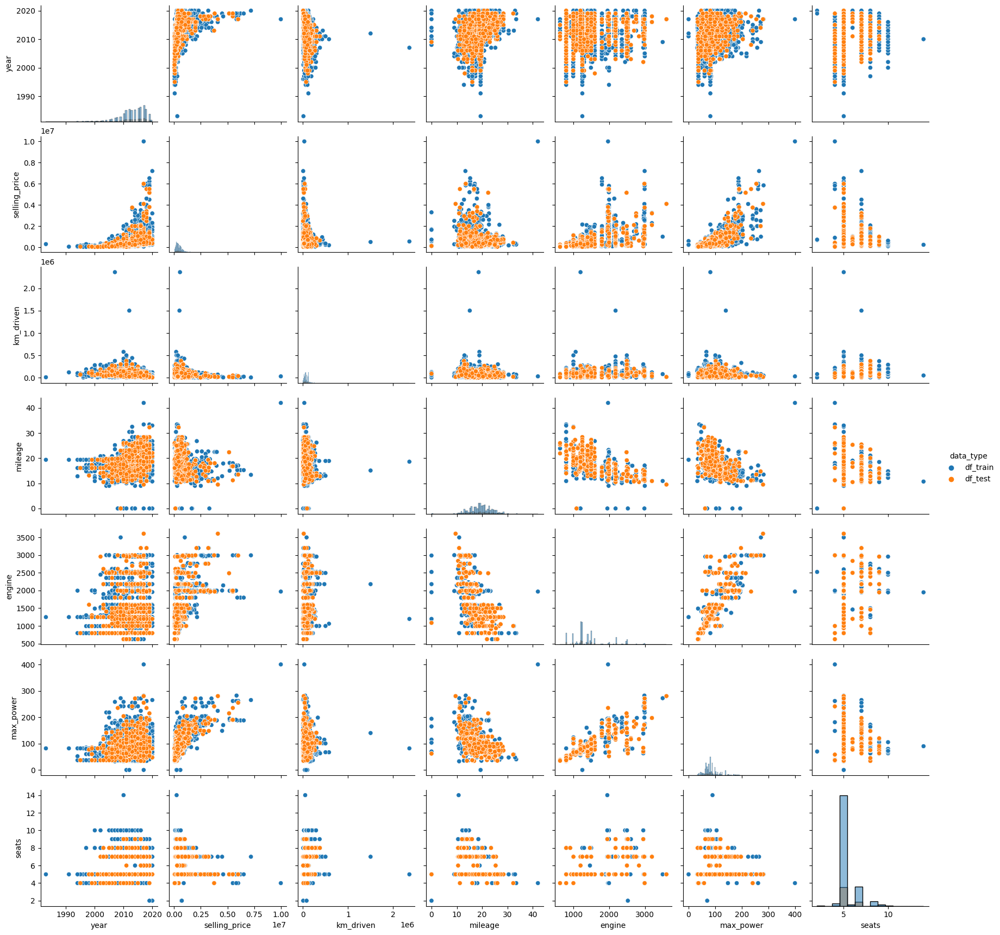
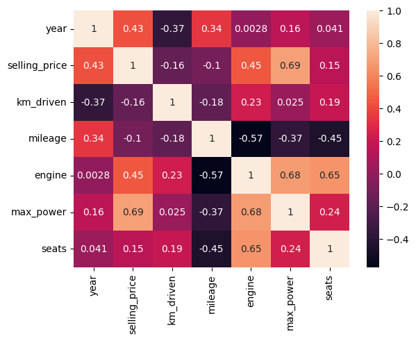
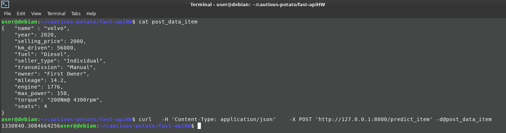
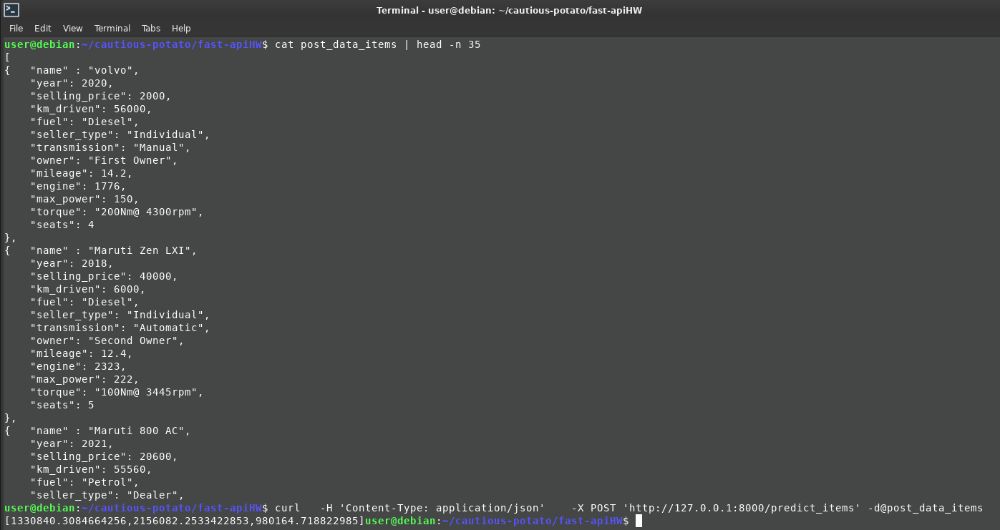

## Результаты проделанной работы

Результаты применения семейста стандартных линейных моделей на данных об автомобилях.

### Что хотели сделать

Всего данных для обучения - **6999**, для теста - **1000**

Каждый автомобиль харакетризуется следующими параметрами (есть пропуски):

| Номер | Нвименование переменной в датасете | Описание                                    |
|-------|------------------------------------|---------------------------------------------|
| 0     | **selling_price**                  | Стоимость. Целевая переменная               |
| 1     | `name`                             | Марка авто                                  |
| 2     | `km_driven`                        | Пробег                                      |
| 3     | `seller_type`                      | Вид продавца                                |
| 4     | `transmission`                     | Тип коробки передач                         |
| 5     | `owner`                            | Количество владельцев                       |
| 6     | `mileage`                          | Пробег в милях                              |
| 7     | `engine`                           | Тип мотора (топлива)                        |
| 8     | `max_power`                        | Мощность                                    |
| 9     | `torque`                           | Крутящий момент (что-то там при чем-то там) |
| 10    | `seats`                            | Количество посадочных мест                  |

Нужно научиться предсказывать выгодную цену продажи по этим характетискам. 

*Правда Заказчику на сказали, что это динамичный рынок и нужно каждый день переобучать все.*

### Передварительная обработка

Во всех даных сначала были найдены (**1159**) и удалены дубликаты

Пропущенные значения заменены медианой (для числовых признаков)

Содержимое ячеек данных очищено от лишных символов и символов

Данные приведены к соответствующему типу: числовые к int или float, категориальные - string

### Разведочный анализ

Подготовленные данные были немного исследованы на предмет поиска явных или скрытых зависимостей, упущенных взаимосвязях и просто знакомства

Связи данных (ораньжевый - `test`, синий - `train`):

Сила линейных связей на `train`

Самые сильно связанные:
- `seller_type` и  `max_power` 
- `engine` и `max_power`  
- `engine` и `seats`  

### Выбор оптимальной линейной модели 

>*тут я уже подустал писать. Буду краток*

Сначала попробовали модель только на **вещественных** признаках.

Выбор из 3 основных моделей: [LinearRegression](https://scikit-learn.org/stable/modules/generated/sklearn.linear_model.LinearRegression.html#sklearn.linear_model.LinearRegression) ,  [Lasso](https://scikit-learn.org/stable/modules/generated/sklearn.linear_model.Lasso.html) ,   [ElasticNet](https://scikit-learn.org/stable/modules/generated/sklearn.linear_model.ElasticNet.html) 

Лучший результат по R2 (около 0.5) показала модель `ElasticNet`

Потом попробовали модель  на **вещественных и категориальных** признаках.

Лучший результат по R2 (около 0.6) показала модель  [Ridge](https://scikit-learn.org/stable/modules/generated/sklearn.linear_model.Ridge.html) 

При этом всегда данные в зависимости от типа стандартизовывалиcь, кодировались onehote, брались уже очищенными. Параметры моделей подбирались с использованием `GridSearchCV` 

### Бизнесс-метрика

Заказчику не очень охота воспринимать мтерики обучения и потому для него посчитали бзнесс-метрику: ***доля** предиктов среди всех предсказанных цен на авто, отличающихся от реальных цен на эти авто не более чем на 10% (в одну или другую сторону)*

Похоже он не оплатит нам работу  - получилось всего  **23.3 %**
### Реализация псевдо-сервиса на FastApi для демонстрации Заказчику

Но аванс же уплачен, надо хотя бы его отработать...

Мини-сервис на FastAPI. Код в `./main.py`.

Данные для тестирования `curl`-ом в папке `./test`

Пример работы для одного предсказания:

Пример работы для предсказания списка машин:

### Вывод

Линейными моделями сыт не будешь 

